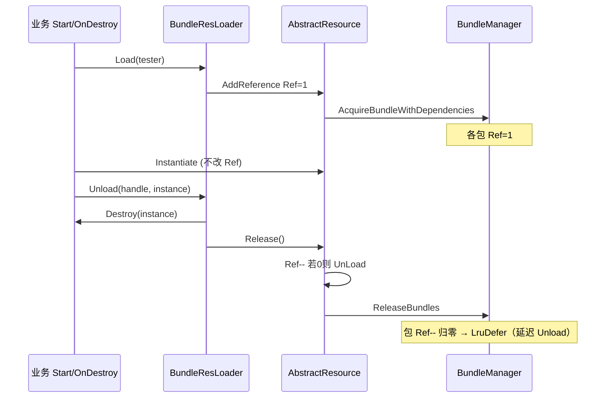

# 引用计数附件（RefCount Appendix）

> **文档性质**：`BusinessApiUsageGuide.md` 的 **引用计数附件** — 按 API 指南常见写法逐步追踪三层计数如何变化，并对应代码入口与链路。  
> **主文档**：规则速查见 [业务API §6](Assets/vFramework/BaseFramework/BaseAssetSys/Docs/BusinessApiUsageGuide.md#sec-refcount-rules)；抄代码见 [§7](Assets/vFramework/BaseFramework/BaseAssetSys/Docs/BusinessApiUsageGuide.md#sec-scenarios)。  
> **代码入口**：`AbstractResource.cs`、`BundleResLoader.cs`、`BundleManager.cs`、`PrefabPool.cs`、`PrefabPoolManager.cs`

---

## 0. 三层计数（mental model）

系统里同时存在 **三套互不替代的计数**：

```text
┌─────────────────────────────────────────────────────────────┐
│ ① AbstractResource.Ref                                      │
│   字段：AbstractResource.Ref                                │
│   +1：BundleResLoader.Load → AddReference()                 │
│   -1：IAssetHandle.Release() → Ref==0 → UnLoad()            │
│   缓存：resourceDic[key]，key = bundleName/assetName        │
└───────────────────────────┬─────────────────────────────────┘
                            │ Ref==0 → ReleaseLoadedAsset()
┌───────────────────────────▼─────────────────────────────────┐
│ ② BundleManager.BundleEntry.Ref（每个 AB 包）               │
│   +1：首次 LoadAsset 时 AcquireBundle(依赖+主包)              │
│   -1：UnLoad 时 ReleaseBundles(acquiredBundleNames)         │
│   注意：同 Provider 多次 AddReference 不会再次 Acquire      │
└─────────────────────────────────────────────────────────────┘

┌─────────────────────────────────────────────────────────────┐
│ ③ PrefabPool.refCount（池模块份额，与 ① 独立）              │
│   +1：GetOrCreatPool（新建 Initialize=1，或 RegisterShare） │
│   -1：ReleasePoolShare → 归零 TearDown → prefabHandle.Release│
│   GetObj / RecycleObj：不动 ① 和 ③ 的「资源/份额」计数      │
└─────────────────────────────────────────────────────────────┘
```

**Instantiate / Destroy 实例**：不改 ① Ref、不改 ② Bundle Ref（除非 ① 归零触发 UnLoad）。

---

## 1. 写法 A：模块持句柄 + OnDestroy Unload（§7.1）

```csharp
_prefab = BundleResLoader.Instance.Load<GameObject>("Model/Prefabs/tester");
_instance = _prefab?.Instantiate();
_icon = BundleResLoader.Instance.Load<Sprite>("Icon/3");
// OnDestroy: Unload(_icon, null); Unload(_prefab, _instance);
```

### 模拟（tester、Icon/3 各在不同 AB）

| 步骤 | 调用 | ① Resource Ref | ② Bundle Ref | 说明 |
|------|------|----------------|--------------|------|
| 1 | `Load<GameObject>("Model/Prefabs/tester")` | tester: **1** | 依赖包+主包各 **1** | 新建 Provider + `AddReference` + `LoadAsset` |
| 2 | `_prefab.Instantiate()` | tester: **1** | 不变 | 只克隆 GO |
| 3 | `Load<Sprite>("Icon/3")` | Icon: **1** | Icon 包 **1** | 另一条 Provider |
| 4 | `Unload(_icon, null)` | Icon: **0** → UnLoad | Icon 包 **0** → LruDefer | `resource.Release()` |
| 5 | `Unload(_prefab, _instance)` | tester: **0** → UnLoad | tester 相关包 **0** → LruDefer | Destroy GO + Release |

### 链路



### 代码对应

- 缓存命中 / 新建：`BundleResLoader.LoadByBundle` → `AddReference` / `LoadAsset`  
  文件：`ResLoader/Business/BundleResLoader.cs`
- Release → UnLoad：`AbstractResource.Release` / `UnLoad`  
  文件：`AbstractAssets/AbstractResource.cs`
- Bundle Acquire / Release：`BundleManager.AcquireBundle` / `ReleaseBundle`（Ref=0 后 LRU 延迟卸载，见 `LoaderOptimizationPlan.md` §4.5）  
  文件：`ResLoader/Bundle/BundleManager.cs`

---

## 2. 写法 B：Load 1 次 + Instantiate N 次（§7.2 / §6.2③）

```csharp
_handle = Load<GameObject>(path);
for (int i = 0; i < n; i++) _list.Add(_handle.Instantiate());
// OnDestroy: Destroy 全部 + _handle.Release() 一次
```

| 步骤 | ① Ref | 实例 |
|------|-------|------|
| Load 1 次 | **1** | 0 |
| Instantiate ×3 | **1**（不变） | 3 个 GO |
| Release 1 次 | **0** → UnLoad | GO 需先 Destroy |

**错误写法**：3 个子脚本各 `Release` 同一句柄 → 第 1 次 Ref=0 卸 AB，后 2 次无效或误减。

---

## 3. 写法 C：N 次 Load 缓存命中（§6.1）

```csharp
var h1 = Load<GameObject>(samePath);
var h2 = Load<GameObject>(samePath);
h1.Release();
h2.Release();
```

| 步骤 | ① Ref | 返回对象 |
|------|-------|----------|
| Load #1 | **1** | 同一 `AbstractResource` |
| Load #2 | **2** | 同一对象，`AddReference` |
| Release h1 | **1** | 仍 Loaded |
| Release h2 | **0** | UnLoad |

**与 YooAsset 差异**：当前实现多次 `Load` 返回 **同一个** Provider 对象，不是每次新建 Handle 包装。

---

## 4. 写法 D：Direct 敌人（enemyManager Direct 模式）

```csharp
enemyPrefabHandle = BundleResLoader.Instance.Load<GameObject>(EnemyPath);
// 生成: enemyPrefabHandle.InstantiateAt(...)
// OnDestroy: enemyPrefabHandle?.Release();
```

| 时刻 | ① enemy Ref | ③ 池 refCount | 场上敌人 |
|------|-------------|---------------|----------|
| Start Load | **1** | 0（无池） | 0 |
| Spawn ×3 Instantiate | **1** | 0 | 3（句柄在 manager） |
| 敌人死亡 Destroy | **1** | 0 | 2（不动 Ref） |
| manager OnDestroy Release | **0** | 0 | — |

**Ref 只跟 manager 生命周期**，与实例生死无关。

---

## 5. 写法 E：对象池 + 综合测试（§7.7 / §5.5）

路径示例：`BulletPath = "Model/Prefabs/Bullet"`，`EnemyPath = "Model/Prefabs/enemy"`。

### 5.1 玩家首次射击建子弹池

```csharp
bulletPool = PrefabPoolManager.Instance.GetOrCreatPool(BulletPath, maxInactiveCapacity: 48);
```

| 层 | 变化 |
|----|------|
| ③ 池 refCount | **1**（`Initialize`） |
| ① Bullet Ref | **1**（`CreatePool` 内 `Load` 一次） |
| ② Bundle | 子弹 AB 首次 Acquire |

```text
GetOrCreatPool
  → map 无池 → CreatePool
    → BundleResLoader.Load(BulletPath)     // ① Ref++
    → new PrefabPool(handle)
    → Initialize()                           // ③ refCount=1
    → map[loadPath]=pool
```

代码：`PrefabPoolManager.CreatePool` → `PrefabPool.Initialize`

### 5.2 敌人首次射击再 GetOrCreatPool（共享）

| 层 | 变化 |
|----|------|
| ③ 池 refCount | **2**（`RegisterShare`，**不再 Load**） |
| ① Bullet Ref | **仍 1** |
| maxInactive | 48×2=96 |

代码：`PrefabPoolManager.GetOrCreatPool` 命中 → `PrefabPool.RegisterShare`

### 5.3 开火：GetObj → SetOwner → RecycleObj

```csharp
bulletGo = bulletPool.GetObj(pos, rot);
bulletGo.GetComponent<Bullet>()?.SetOwner(BulletOwner.Player);
// 寿命/碰撞 → RecycleObj
```

| 操作 | ① Ref | ③ refCount | Active/Inactive |
|------|-------|------------|-----------------|
| GetObj | 不变 | 不变 | Active+1 |
| RecycleObj | 不变 | 不变 | Active-1, Inactive+1 |
| 闲置空时再 GetObj | 不变 | 不变 | 可能 `InstantiateAt`（不再次 Load） |

`Bullet.OnEnable` 里 `TryGetPool` 只读池，**不加 refCount**。

### 5.4 ReleasePoolShare（对称卸份额）

敌人 A `OnDestroy` → `ReleasePoolShare(BulletPath)`：

| 层 | 变化 |
|----|------|
| ③ refCount | 2→**1** |
| ① Ref | **仍 1**（未 TearDown） |

玩家 `OnDestroy` → 再 `ReleasePoolShare`：

| 层 | 变化 |
|----|------|
| ③ refCount | 1→**0** → `TearDown` |
| ① Ref | `prefabHandle.Release()` → **0** → UnLoad |

代码：`PrefabPool.ReleaseShare` → `TearDown` → `prefabHandle.Release()`

### 5.5 敌人池（Pooled 模式 enemyManager）

```csharp
enemyPool = PrefabPoolManager.Instance.GetOrCreatPool(EnemyPath, maxInactiveCapacity: 12);
// Spawn: GetObj；死亡: RecycleObj；manager OnDestroy: ReleasePoolShare(EnemyPath)
```

| 事件 | ① enemy Ref | ③ enemy 池 refCount |
|------|-------------|---------------------|
| manager GetOrCreatPool | **1** | **1** |
| 刷怪 / 死亡 RecycleObj | **1** | **1** |
| manager ReleasePoolShare | **0** | TearDown |

Pooled 敌人死亡 **不** 卸子弹池份额。

### 5.6 TryGetPool（借方，不加份额）

| 操作 | ③ refCount | ① Ref |
|------|------------|-------|
| TryGetPool | **不变** | 不变 |
| GetObj / RecycleObj | 不变 | 不变 |

---

## 6. DeletePool vs ReleasePoolShare

| API | ③ refCount | ① Ref | 借出实例 |
|-----|------------|-------|----------|
| `ReleasePoolShare` | --，归零才 TearDown | 仅 TearDown 时 -1 | 归零时强制 Destroy |
| `DeletePool` | 直接 `ForceDelete` | **立即** -1（TearDown） | 强制 Destroy 全部 |

**场景**：紧急清池、调试、借出未还也要立刻卸 AB → `DeletePool`；正常对称退场 → `ReleasePoolShare`。

代码：`PrefabPoolManager.DeletePool` → `PrefabPool.ForceDelete`

---

## 7. UnloadAll（§5.3 / ComprehensiveTestSceneFlow）

```csharp
BundleResLoader.Instance.UnloadAll();
```

```text
UnloadAll
  ① PrefabPoolManager.DeleteAllPools()
       每个池 ForceDelete → TearDown → 各池 prefabHandle.Release() 一次
  ② 拷贝 resourceDic → Clear → 每条 res.UnLoad()（直接卸，不经 Ref 递减）
  ③ BundleManager.UnloadAll()
```

代码：`BundleResLoader.UnloadAll`

**注意**：日常仍应用 `ReleasePoolShare` 对称收尾；`UnloadAll` 作进程级兜底。若资源仅被池持有一份且池已 TearDown，`UnloadAll` 再 `UnLoad` 时 Ref 可能已为 0（`ReleaseLoadedAsset` 对空 asset 仍安全）。

---

## 8. 错误模式对照（§6.2）

### 只 Destroy 不 Release

```text
Load → Ref=1 → Instantiate → Destroy(go) → Ref 仍 1 → AB 泄漏
```

### 同一句柄 Release 多次

```text
Load → Ref=1 → Release → Ref=0 UnLoad → 再 Release → Ref<=0 直接 return
```

### Unload 后又 Release（§6.2⑤）

```text
Unload(handle, go)  // Destroy + Release, Ref--
handle.Release()    // 多减一次（Ref 已 0 则 no-op）
```

### handle.Instance 两次（§6.2⑥）

```text
每次 Instance 都 Instantiate → 2 个 GO，Ref 仍 1 → 只 Release 一次会留孤儿 GO
```

---

## 9. 综合测试一局时间线（数字汇总）

假设：Pooled 敌人；玩家 + 2 敌人各 `GetOrCreatPool` 子弹；敌人池仅 manager。

| 时刻 | ① Bullet Ref | ③ Bullet refCount | ① Enemy Ref | ③ Enemy refCount |
|------|----------------|-------------------|-------------|------------------|
| 玩家首射 GetOrCreatPool | 1 | 1 | — | — |
| 敌人1 GetOrCreatPool | 1 | 2 | — | — |
| 敌人2 GetOrCreatPool | 1 | 3 | — | — |
| manager 建敌人池 | — | — | 1 | 1 |
| 战斗中 GetObj/RecycleObj | 1 | 3 | 1 | 1 |
| 敌人1死亡 ReleasePoolShare | 1 | 2 | 1 | 1 |
| 敌人2死亡 | 1 | 1 | 1 | 1 |
| 玩家 OnDestroy ReleasePoolShare | **0** | TearDown | 1 | 1 |
| manager OnDestroy ReleasePoolShare(Enemy) | — | — | **0** | TearDown |
| 切场景 UnloadAll | 0 | 0 | 0 | 0 |

Logger `holders`（`PlayerTest.BulletPoolShareCount + enemyTest.BulletPoolShareCount`）应对齐 ③ `refCount`；池存活期间 ① Bullet Ref 一般为 **1**。

---

## 10. API → 计数速查表

| API | ① Resource Ref | ② Bundle Ref | ③ Pool refCount |
|-----|----------------|--------------|-----------------|
| `Load` | +1 | 首次 LoadAsset 时 Acquire | — |
| `Release` / `Unload(_, null)` | -1 | Ref=0 时 Release | Bundle Ref=0 → **LruDefer** |
| `Instantiate` / `Destroy(GO)` | 不变 | 不变 | — |
| `GetOrCreatPool`（新建） | +1 | 首次时 Acquire | 1 |
| `GetOrCreatPool`（命中） | 不变 | 不变 | +1 |
| `TryGetPool` | 不变 | 不变 | 不变 |
| `GetObj` / `RecycleObj` | 不变 | 不变 | 不变 |
| `ReleasePoolShare` | TearDown 时 -1 | TearDown 时 Release | -1 |
| `DeletePool` / `DeleteAllPools` | TearDown 时 -1 | TearDown 时 Release | 强制清零 |
| `UnloadAll` | 池 Release + 全量 UnLoad | **立即**全卸（含 LRU 队列） | 强制清零 |

---

## 11. 代码文件索引

| 文件 | 职责 |
|------|------|
| `AbstractAssets/AbstractResource.cs` | ① Ref、`Release`、`UnLoad`、`InstantiateAt` |
| `ResLoader/Business/BundleResLoader.cs` | `Load`、`Unload`、`UnloadAll`、`resourceDic` |
| `ResLoader/Bundle/BundleManager.cs` | ② Bundle Ref |
| `ResLoader/Router/AbBundleAssetProvider.cs` | Load 时 Acquire、Release 时 ReleaseBundles |
| `AssetPool/PrefabPool.cs` | ③ refCount、`GetObj`、`RecycleObj`、`TearDown` |
| `AssetPool/PrefabPoolManager.cs` | 池注册表、场景分池、`GetOrCreatPool`、`ReleasePoolShare`、`DeletePool` |
| `AssetPool/PoolSceneRootsUtil.cs` | 场景 `PoolRuntime` / `Pool_*` 父节点 |
| `BaseLogSys/AssetRefTraceLogger.cs` | 运行时 Resource/Bundle/Pool Trace（`DumpRecent`） |

---

## 12. 运行时追溯（AssetRefTraceLogger）

Editor / Development 构建下，加载与池生命周期会自动输出 `[AssetRefTrace][RefCountCheck]` 日志。

```csharp
// 导出最近 64 条 Trace（排查泄漏 / 过早 UnLoad）
AssetRefTraceLogger.DumpRecent(64);

// 真机 JSONL 路径（UnloadAll 后也会打一条）
AssetRefTraceLogger.FlushDeviceJson();
// AssetRefTraceLogger.DeviceJsonFilePath

// 关闭 Trace（性能敏感场景）
AssetRefTraceLogger.Enabled = false;
```

真机 JSONL：`{persistentDataPath}/vFramework/AssetRefTrace/Logs/ref_trace_*.jsonl`，`purpose=AssetRefCountCheck`，用于校验引用计数是否正常。

### CDN 下载 Trace（阶段 C）

`HttpRemoteBundleProvider` 下载完成后写入 Layer=`CDN`、Reason=`CdnDownload`（含 `bundleName`、`bytes`、`hashOk`）。  
`BundleResLoader.UnloadAll` 前输出仍为非零 Ref 的 Resource / Bundle 摘要（TraceEvent）。

规范与后续 **AssetReference / 统一池** 计划见 [LoaderOptimizationPlan.md](./LoaderOptimizationPlan.md)。

---

*本文档为引用计数附件；API 变更时请同步更新本附件、[LoaderOptimizationPlan.md](./LoaderOptimizationPlan.md) 与 [BusinessApiUsageGuide.md](./BusinessApiUsageGuide.md) §5–§7。*
